# Arc-it Complete Architecture Documentation

## Table of Contents
1. [Overview](#overview)
2. [System Architecture](#system-architecture)
3. [Core Components](#core-components)
4. [Data Flow](#data-flow)
5. [API Reference](#api-reference)
6. [Usage Patterns](#usage-patterns)
7. [File Structure](#file-structure)
8. [Configuration](#configuration)

---

## Overview

Arc-it is a modern React theming and content management library that provides:
- **Dynamic Theme Switching** with CSS variables
- **Multi-language Content Management**
- **Content Style Presets**
- **Tailwind CSS Integration**
- **Security Features**
- **Smart Content Loading** with automatic Speed + SEO + Security optimization
- **Zero Configuration Setup**

---

## System Architecture

### High-Level Architecture
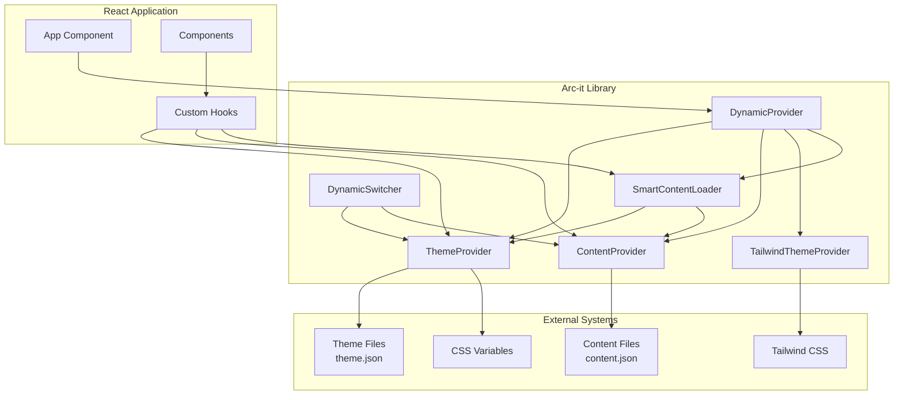

### Provider Hierarchy
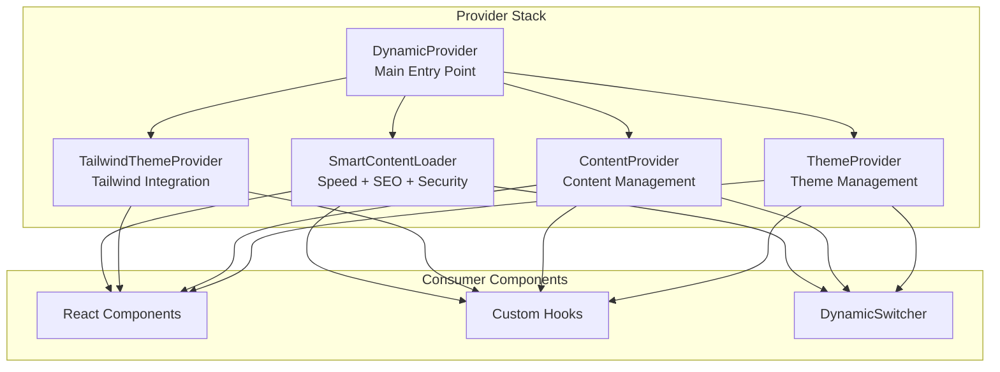

---

## Core Components

### 1. DynamicProvider
**Purpose**: Main entry point that combines all providers
**Location**: `src/DynamicProvider.tsx`

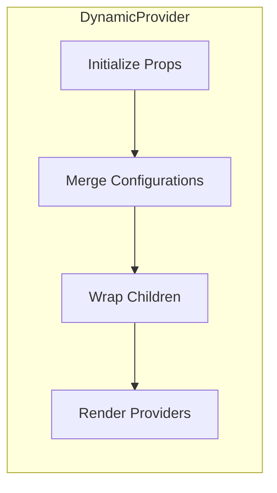

**Key Features**:
- Combines ThemeProvider, ContentProvider, TailwindThemeProvider, and SmartContentLoader
- Handles initialization and configuration merging
- Provides unified context for the entire application

### 2. ThemeProvider
**Purpose**: Manages theme switching and CSS variable application
**Location**: `src/theme/ThemeProvider.tsx`

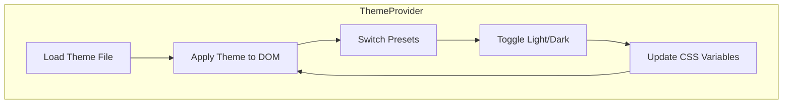

**Key Features**:
- Dynamic theme loading from JSON files
- CSS variable injection
- Preset switching
- Light/dark mode toggle
- Real-time theme updates

### 3. ContentProvider
**Purpose**: Manages multi-language content and content styles
**Location**: `src/content/ContentProvider.tsx`

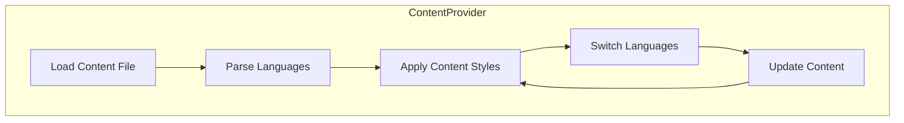

**Key Features**:
- Multi-language content support
- Content style presets
- Dynamic content switching
- Localized content management
- Content reloading

### 4. TailwindThemeProvider
**Purpose**: Integrates themes with Tailwind CSS
**Location**: `src/theme/TailwindThemeProvider.tsx`

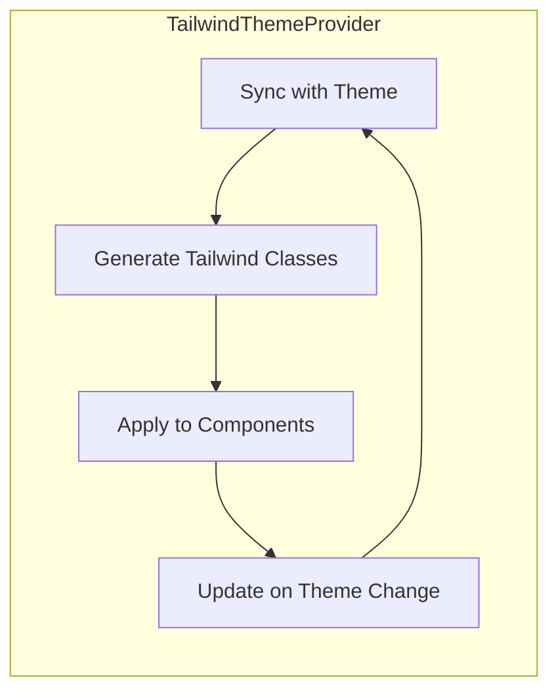

**Key Features**:
- Tailwind CSS integration
- Dynamic class generation
- Theme-aware styling
- Responsive design support

### 5. SmartContentLoader
**Purpose**: Provides automatic Speed + SEO + Security optimization
**Location**: `src/content/SmartContentLoader.ts`

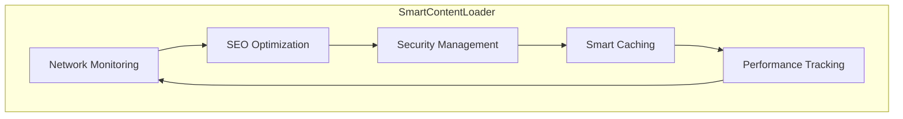

**Key Features**:
- Automatic network adaptation
- Smart caching strategies
- Progressive content loading
- SEO optimization (structured data, meta tags, Open Graph)
- Security features (anti-scraping, rate limiting, watermarking)
- Performance monitoring and optimization

---

## Data Flow

### Theme Switching Flow
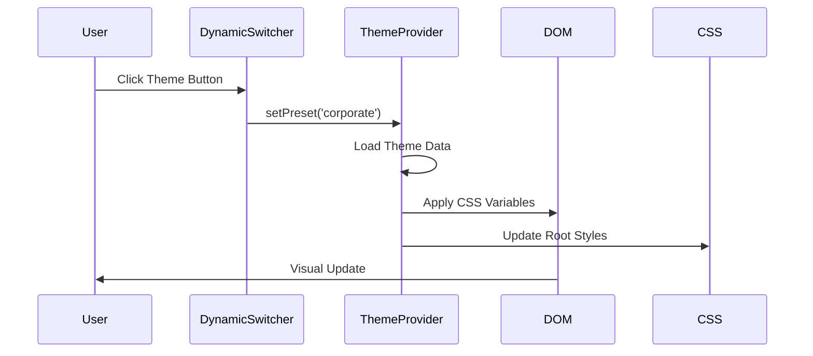

### Content Switching Flow
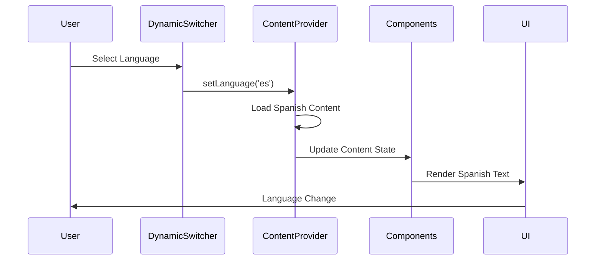

### Smart Content Loading Flow
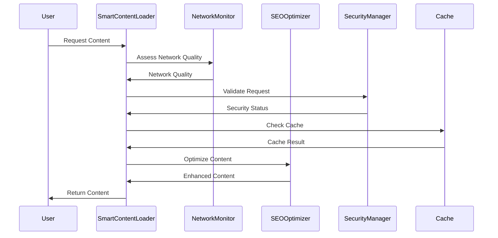

### Complete Data Flow
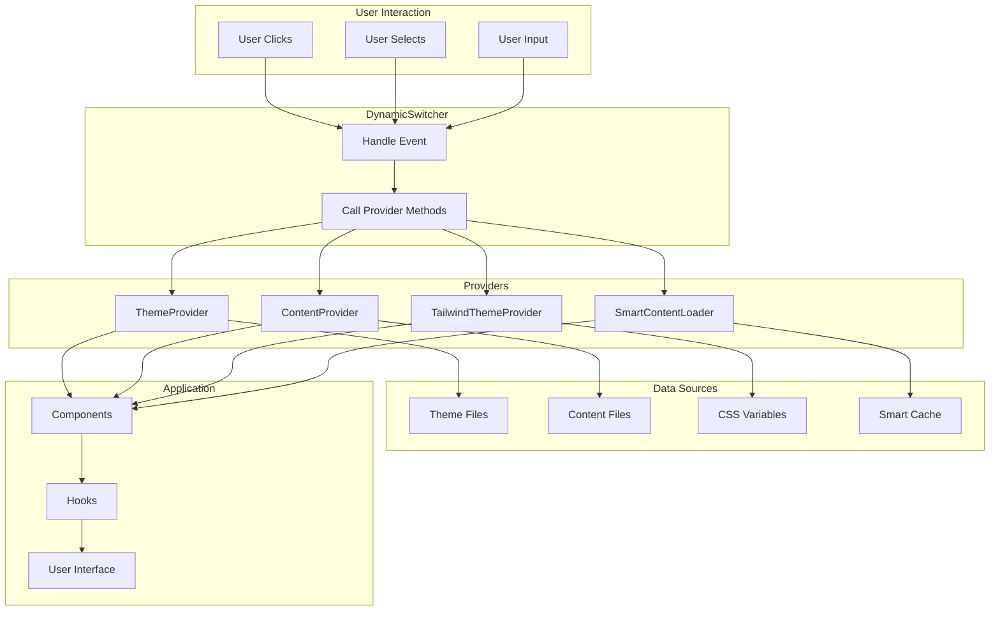

---

## API Reference

### Core Hooks

#### useTheme()
```typescript
const {
  theme,
  isDarkMode,
  currentPreset,
  availablePresets,
  setPreset,
  toggleDarkMode,
  getColor,
  getFont
} = useTheme();
```

#### useContent()
```typescript
const {
  content,
  language,
  setLanguage,
  languages,
  reloadContent
} = useContent();
```

#### useContentSection()
```typescript
const heroContent = useContentSection('hero');
const aboutContent = useContentSection('about');
```

#### useContentStyle()
```typescript
const {
  currentStyle,
  setContentStyle,
  availableStyles
} = useContentStyle();
```

#### useSmartContent()
```typescript
const {
  content,
  loading,
  error,
  stats,
  seo,
  performance
} = useSmartContent(loader, contentType, authToken, options);
```

### Provider Props

#### DynamicProvider
```typescript
<DynamicProvider
  themePath="/content/theme.json"
  contentSource="/content/content.json"
  initialThemePreset="space"
  initialLanguage="en"
  initialContentStyle="default"
>
  {children}
</DynamicProvider>
```

#### ThemeProvider
```typescript
<ThemeProvider
  themePath="/content/theme.json"
  initialPreset="space"
>
  {children}
</ThemeProvider>
```

#### ContentProvider
```typescript
<ContentProvider
  source="/content/content.json"
  initialLanguage="en"
  initialStyle="default"
>
  {children}
</ContentProvider>
```

---

## Usage Patterns

### Basic Theme Usage
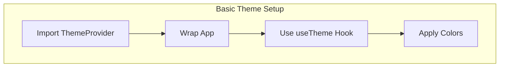

### Advanced Content Management
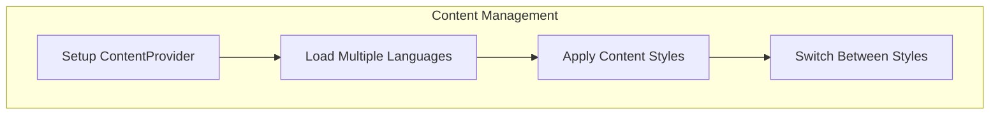

### Smart Content Loading
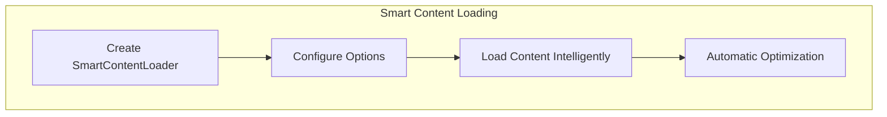

### Complete Integration
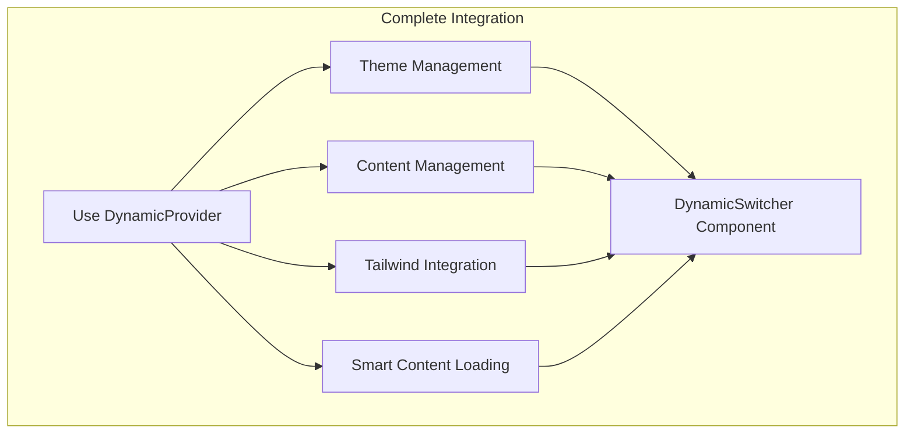

---

## File Structure

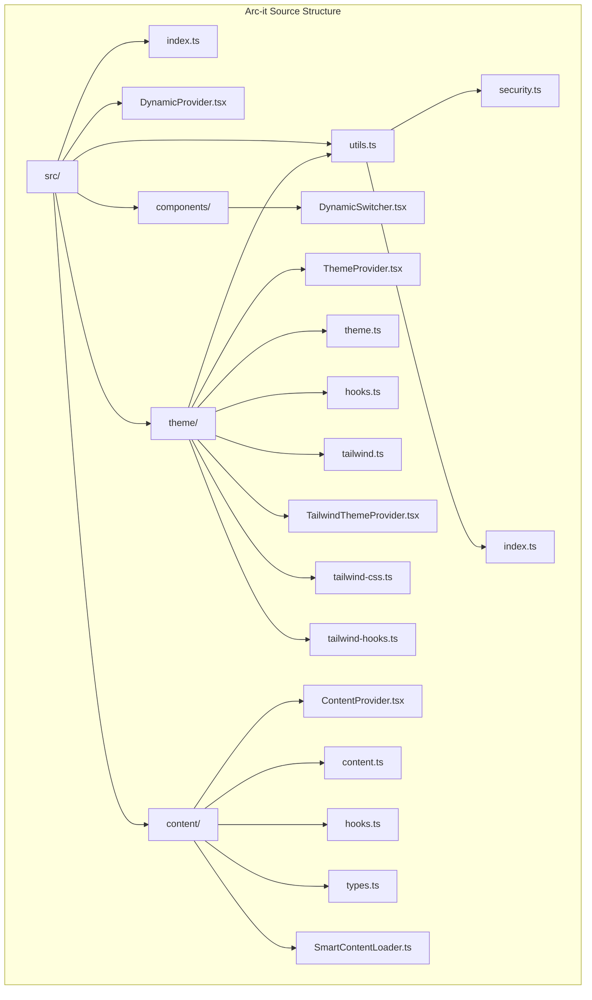

### Detailed File Descriptions

#### Core Files
- **`index.ts`**: Main export file with all public APIs including SmartContentLoader
- **`DynamicProvider.tsx`**: Main provider component that integrates all systems
- **`components/DynamicSwitcher.tsx`**: Ready-to-use theme switcher

#### Theme System
- **`theme/ThemeProvider.tsx`**: Theme context and management
- **`theme/theme.ts`**: Theme utilities and functions
- **`theme/hooks.ts`**: Theme-related React hooks
- **`theme/tailwind.ts`**: Tailwind CSS integration
- **`theme/TailwindThemeProvider.tsx`**: Tailwind-specific provider

#### Content System
- **`content/ContentProvider.tsx`**: Content context and management
- **`content/content.ts`**: Content utilities and functions
- **`content/hooks.ts`**: Content-related React hooks
- **`content/types.ts`**: TypeScript type definitions
- **`content/SmartContentLoader.ts`**: Smart content loading with Speed + SEO + Security

#### Utilities
- **`utils/security.ts`**: Security features and validation
- **`utils/index.ts`**: Utility exports

---

## Configuration

### Theme Configuration (theme.json)
```json
{
  "colors": {
    "primary": "#00ff0d",
    "secondary": "#bbf7d0",
    "background": "#000000",
    "text": "#ffffff"
  },
  "presets": {
    "space": {
      "name": "Space Theme",
      "colors": { ... }
    },
    "space-light": {
      "name": "Space Theme (Light)",
      "colors": { ... }
    }
  }
}
```

### Content Configuration (content.json)
```json
{
  "languages": ["en", "es", "fr"],
  "styles": {
    "default": {
      "name": "Default Style",
      "description": "Standard content style"
    }
  },
  "sections": {
    "hero": {
      "en": { "title": "Welcome", "subtitle": "Get Started" },
      "es": { "title": "Bienvenido", "subtitle": "Comenzar" }
    }
  }
}
```

### Smart Content Loader Configuration
```typescript
const loader = createSmartContentLoader({
  extendExisting: true,
  enhanceSEO: true,
  security: {
    antiScraping: true,
    rateLimiting: true,
    contentObfuscation: false,
    watermarking: true
  },
  performance: {
    cacheStrategy: 'balanced',
    preloadStrategy: 'smart',
    compressionLevel: 'medium'
  }
});
```

---

## Security Features

### Security Architecture
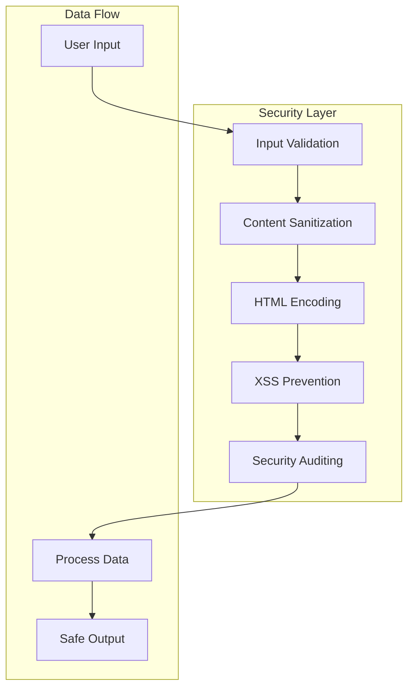

### Security Features
- **Input Validation**: All user inputs are validated
- **Content Sanitization**: HTML content is sanitized
- **XSS Prevention**: Cross-site scripting protection
- **Security Auditing**: Built-in security checks
- **Type Safety**: TypeScript for compile-time safety
- **Anti-scraping**: Protection against automated content harvesting
- **Rate Limiting**: Prevention of abuse and DDoS attacks
- **Content Watermarking**: Tracking and audit trails

---

## Performance Features

### Performance Optimizations
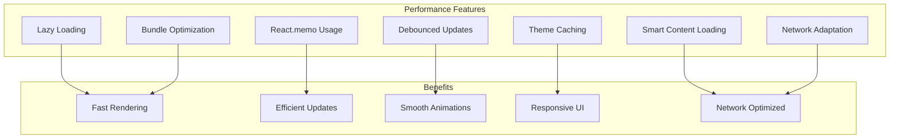

### Optimization Strategies
- **Lazy Loading**: Components load on demand
- **Memoization**: Prevents unnecessary re-renders
- **Debounced Updates**: Batches rapid changes
- **Theme Caching**: Caches theme data
- **Bundle Optimization**: Tree-shaking and code splitting
- **Smart Caching**: Adaptive caching based on network conditions
- **Network Adaptation**: Automatically optimizes for network quality
- **Progressive Loading**: Loads essential content first

---

## Development Workflow

### Development Setup
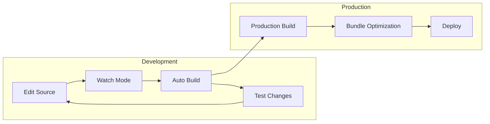

### Development Commands
```bash
# Development with watch mode
npm run dev:fast

# Production build
npm run build

# Standard watch mode
npm run dev
```

---

## Monitoring and Debugging

### Debug Architecture
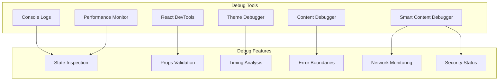

### Debug Features
- **Console Logging**: Detailed operation logs
- **React DevTools**: Component inspection
- **Theme Debugger**: Theme state inspection
- **Content Debugger**: Content state inspection
- **Performance Monitor**: Performance metrics
- **Network Monitor**: Network quality and optimization status
- **Security Monitor**: Security features and threat detection

---

## Future Roadmap

### Planned Features
```mermaid
graph TD
    subgraph "Future Features"
        PLUGINS[Plugin System]
        ANALYTICS[Usage Analytics]
        AI[AI-Powered Themes]
        CLOUD[Cloud Sync]
        MOBILE[Mobile Optimization]
    end
    
    subgraph "Enhancements"
        PERFORMANCE[Performance Improvements]
        SECURITY[Security Enhancements]
        UX[User Experience]
        ACCESSIBILITY[Accessibility]
    end
    
    PLUGINS --> PERFORMANCE
    ANALYTICS --> SECURITY
    AI --> UX
    CLOUD --> ACCESSIBILITY
    MOBILE --> PERFORMANCE
```

### Roadmap Items
- **Plugin System**: Extensible architecture
- **Usage Analytics**: User behavior insights
- **AI-Powered Themes**: Intelligent theme generation
- **Cloud Sync**: Theme synchronization
- **Mobile Optimization**: Mobile-first design

---

## Conclusion

Arc-it provides a comprehensive solution for:
- **Dynamic theming** with CSS variables
- **Multi-language content** management
- **Content style** presets
- **Tailwind CSS** integration
- **Security** and performance
- **Smart Content Loading** with automatic Speed + SEO + Security optimization
- **Developer experience** with live updates

The architecture is designed to be:
- **Modular**: Each system is independent
- **Extensible**: Easy to add new features
- **Performant**: Optimized for speed
- **Secure**: Built-in security features
- **Developer-friendly**: Comprehensive tooling

For more information, see:
- [QUICK_START.md](./QUICK_START.md) - Quick start guide
- [DEV_SETUP.md](./DEV_SETUP.md) - Development setup
- [README.md](./README.md) - Complete documentation
- [SMART_CONTENT_INTEGRATION.md](./docs/SMART_CONTENT_INTEGRATION.md) - Smart Content Loading guide
