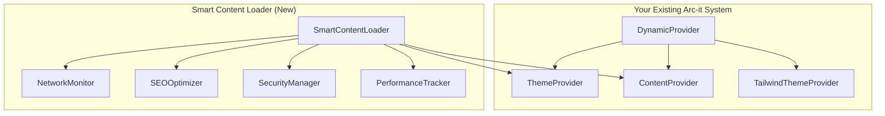

# 🚀 Smart Content Loader - Integration with Arc-it

## 🎯 **Integration Philosophy: Extend, Don't Replace**

The Smart Content Loader is designed to **extend your existing Arc-it system**, not replace it. This means:

- ✅ **Your existing code works exactly the same**
- ✅ **All your current themes, languages, and styles continue to work**
- ✅ **You get additional features without any breaking changes**
- ✅ **Seamless integration with your current architecture**

---

## 🔗 **How Integration Works**

### **1. Existing System (Unchanged)**
```typescript
// Your existing Arc-it system continues to work exactly as before
import { DynamicProvider, useTheme, useContent } from '@aahrbitx/arc-it';

function MyComponent() {
  const { setPreset, currentPreset, toggleDarkMode } = useTheme();
  const { content, language, setLanguage } = useContent();
  
  // All your existing functionality works unchanged
  return (
    <div>
      <h1>{content[language]?.title}</h1>
      <button onClick={() => setPreset('green')}>Green Theme</button>
      <button onClick={toggleDarkMode}>Toggle Dark Mode</button>
    </div>
  );
}
```

### **2. Add Smart Features (Optional)**
```typescript
// Add Smart Content Loader for additional features
import { createSmartContentLoader, useSmartContent } from '@aahrbitx/arc-it';

function MyEnhancedComponent() {
  // Create loader that integrates with your existing system
  const loader = createSmartContentLoader({
    extendExisting: true,           // Integrate with existing system
    enhanceSEO: true,               // Add SEO to existing content
    security: {
      antiScraping: true,           // Block automated scraping
      rateLimiting: true            // Prevent abuse
    }
  });

  // Use smart content loading
  const { content, stats, seo } = useSmartContent(
    loader,
    'existing',                     // Use existing ContentProvider
    undefined,                      // No auth needed
    { useExisting: true }          // Integrate with existing system
  );

  return (
    <div>
      <h1>{content?.title}</h1>
      <p>Load time: {stats?.loadTime}ms</p>
      <p>Security level: {stats?.securityLevel}</p>
    </div>
  );
}
```

---

## 🏗️ **Architecture Integration**

### **Provider Stack (Your Existing System)**


### **Integration Points**
1. **ThemeProvider**: SmartContentLoader can access your existing theme data
2. **ContentProvider**: SmartContentLoader can enhance your existing content
3. **DynamicProvider**: Everything works together seamlessly

---

## 🚀 **Integration Examples**

### **Example 1: Basic Integration**
```typescript
import { DynamicProvider, useTheme, createSmartContentLoader } from '@aahrbitx/arc-it';

function App() {
  return (
    <DynamicProvider>
      <EnhancedComponent />
    </DynamicProvider>
  );
}

function EnhancedComponent() {
  const { currentPreset } = useTheme(); // Your existing theme system
  
  // Add smart content features
  const loader = createSmartContentLoader({
    extendExisting: true,
    enhanceSEO: true
  });

  return (
    <div>
      <h1>Theme: {currentPreset}</h1>
      <p>Enhanced with smart content loading!</p>
    </div>
  );
}
```

### **Example 2: Advanced Integration**
```typescript
import { 
  DynamicProvider, 
  useTheme, 
  useContent,
  createSmartContentLoader, 
  useSmartContent 
} from '@aahrbitx/arc-it';

function AdvancedApp() {
  return (
    <DynamicProvider>
      <AdvancedComponent />
    </DynamicProvider>
  );
}

function AdvancedComponent() {
  // Your existing system
  const { currentPreset, isDarkMode } = useTheme();
  const { language, content } = useContent();
  
  // Smart content loader
  const loader = createSmartContentLoader({
    extendExisting: true,
    enhanceSEO: true,
    security: {
      antiScraping: true,
      rateLimiting: true,
      watermarking: true
    }
  });

  // Enhanced content loading
  const { content: enhancedContent, stats, seo } = useSmartContent(
    loader,
    'existing',
    undefined,
    { useExisting: true }
  );

  return (
    <div>
      {/* Your existing functionality */}
      <h1>Theme: {currentPreset}</h1>
      <p>Mode: {isDarkMode ? 'Dark' : 'Light'}</p>
      <p>Language: {language}</p>
      
      {/* Enhanced content */}
      <h2>{enhancedContent?.title}</h2>
      <p>Load time: {stats?.loadTime}ms</p>
      <p>Security: {stats?.securityLevel}</p>
      
      {/* SEO data */}
      <script type="application/ld+json">
        {JSON.stringify(seo.structuredData)}
      </script>
    </div>
  );
}
```

---

## 🔧 **Configuration Options**

### **Integration Configuration**
```typescript
const loader = createSmartContentLoader({
  // Integration settings
  extendExisting: true,           // Integrate with existing system
  enhanceSEO: true,               // Add SEO to existing content
  
  // Smart features
  autoOptimize: true,             // Enable all optimizations
  networkOptimization: true,      // Adapt to network conditions
  
  // Security features
  security: {
    antiScraping: true,           // Block automated scraping
    rateLimiting: true,           // Prevent abuse
    contentObfuscation: false,    // Don't obfuscate public content
    watermarking: true            // Track usage
  },
  
  // Performance tuning
  performance: {
    cacheStrategy: 'balanced',     // Good balance for most use cases
    preloadStrategy: 'smart',      // Smart preloading
    compressionLevel: 'medium'     // Medium compression
  }
});
```

### **Integration Modes**
```typescript
// Mode 1: Use existing system only
const { content } = useSmartContent(loader, 'existing', undefined, { useExisting: true });

// Mode 2: Use smart loading for new content
const { content } = useSmartContent(loader, 'public', undefined);

// Mode 3: Use smart loading for private content
const { content } = useSmartContent(loader, 'private', 'auth-token');

// Mode 4: Let system choose automatically
const { content } = useSmartContent(loader, 'auto', undefined);
```

---

## 📊 **What You Get with Integration**

### **🚀 Speed Benefits (Automatic)**
- **Network Adaptation**: Automatically detects network quality
- **Smart Caching**: Adapts cache strategy based on conditions
- **Progressive Loading**: Loads essential content first
- **Compression**: Automatically compresses for slow networks

### **🔍 SEO Benefits (Automatic)**
- **Structured Data**: Automatic JSON-LD generation
- **Meta Tags**: Optimized title, description, keywords
- **Open Graph**: Perfect social media sharing
- **Content Enhancement**: SEO-friendly structure

### **🛡️ Security Benefits (Automatic)**
- **Anti-Scraping**: Blocks automated content scraping
- **Rate Limiting**: Prevents abuse and DDoS
- **Content Protection**: Secures sensitive data
- **Access Tracking**: Watermarking for audit trails

---

## 🔄 **Migration Path**

### **Step 1: Keep Your Existing Code (No Changes)**
```typescript
// This continues to work exactly as before
function MyExistingComponent() {
  const { setPreset, currentPreset } = useTheme();
  const { content, language } = useContent();
  
  return (
    <div>
      <h1>{content[language]?.title}</h1>
      <button onClick={() => setPreset('blue')}>Blue Theme</button>
    </div>
  );
}
```

### **Step 2: Add Smart Features (Optional)**
```typescript
// Add this to any component where you want smart features
function MyEnhancedComponent() {
  const loader = createSmartContentLoader({ extendExisting: true });
  
  const { content, stats } = useSmartContent(loader, 'existing', undefined, { useExisting: true });
  
  return (
    <div>
      <h1>{content?.title}</h1>
      <p>Enhanced with smart loading!</p>
    </div>
  );
}
```

### **Step 3: Gradual Enhancement (Over Time)**
```typescript
// Gradually add more smart features as needed
const loader = createSmartContentLoader({
  extendExisting: true,
  enhanceSEO: true,
  security: { antiScraping: true },
  performance: { cacheStrategy: 'aggressive' }
});
```

---

## 🎯 **Best Practices for Integration**

### **1. Start Simple**
```typescript
// Start with basic integration
const loader = createSmartContentLoader({
  extendExisting: true,
  enhanceSEO: true
});
```

### **2. Enhance Gradually**
```typescript
// Add features as you need them
const loader = createSmartContentLoader({
  extendExisting: true,
  enhanceSEO: true,
  security: { antiScraping: true },        // Add security
  performance: { cacheStrategy: 'aggressive' } // Add performance
});
```

### **3. Monitor Performance**
```typescript
// Check how your integration is performing
const stats = loader.getStats();
console.log('Integration status:', stats.integration);
console.log('Performance metrics:', stats.performance);
```

### **4. Use Existing System When Possible**
```typescript
// Prefer existing system for basic functionality
const { content } = useSmartContent(loader, 'existing', undefined, { useExisting: true });

// Use smart loading for new features
const { content: newContent } = useSmartContent(loader, 'public');
```

---

## 🚨 **Common Integration Scenarios**

### **Scenario 1: Business Website**
```typescript
// Keep your existing theme and content system
// Add SEO enhancement and basic security
const loader = createSmartContentLoader({
  extendExisting: true,
  enhanceSEO: true,
  security: {
    antiScraping: true,
    watermarking: true
  }
});
```

### **Scenario 2: E-commerce Platform**
```typescript
// Keep your existing system
// Add security for pricing and user data
const loader = createSmartContentLoader({
  extendExisting: true,
  enhanceSEO: true,
  security: {
    antiScraping: true,
    rateLimiting: true,
    contentObfuscation: true,
    watermarking: true
  }
});
```

### **Scenario 3: Admin Dashboard**
```typescript
// Keep your existing system
// Add maximum security and performance
const loader = createSmartContentLoader({
  extendExisting: true,
  enhanceSEO: false, // Don't need SEO for admin
  security: {
    antiScraping: true,
    rateLimiting: true,
    contentObfuscation: true,
    watermarking: true
  },
  performance: {
    cacheStrategy: 'aggressive',
    preloadStrategy: 'always'
  }
});
```

---

## 🔍 **Troubleshooting Integration**

### **Issue: SmartContentLoader not working with existing system**
```typescript
// Solution: Ensure extendExisting is true
const loader = createSmartContentLoader({
  extendExisting: true,  // This is crucial!
  enhanceSEO: true
});

// Use 'existing' mode with useExisting: true
const { content } = useSmartContent(loader, 'existing', undefined, { useExisting: true });
```

### **Issue: Existing content not being enhanced**
```typescript
// Solution: Check integration status
const stats = loader.getStats();
console.log('Has content provider:', stats.integration.hasContentProvider);
console.log('Has theme provider:', stats.integration.hasThemeProvider);

// Ensure providers are connected
if (!stats.integration.hasContentProvider) {
  console.warn('SmartContentLoader not connected to existing system');
}
```

### **Issue: Performance not improving**
```typescript
// Solution: Check network optimization settings
const loader = createSmartContentLoader({
  extendExisting: true,
  networkOptimization: true,  // Enable network optimization
  performance: {
    cacheStrategy: 'aggressive',  // Use aggressive caching
    preloadStrategy: 'smart'      // Enable smart preloading
  }
});
```

---

## 🎉 **Result: Best of Both Worlds**

With Smart Content Loader integration, you get:

### **✅ Keep Everything You Have**
- All your existing themes work
- All your existing languages work
- All your existing content styles work
- All your existing code works unchanged

### **✅ Get Everything You Need**
- Automatic speed optimization
- Automatic SEO enhancement
- Automatic security protection
- Network adaptation and smart caching

### **✅ Seamless Integration**
- No breaking changes
- No migration required
- No learning curve for existing features
- Gradual enhancement over time

---

## 🚀 **Getting Started with Integration**

### **1. Install (No Changes to Existing Code)**
```bash
npm install @aahrbitx/arc-it@latest
```

### **2. Add Smart Features (Optional)**
```typescript
import { createSmartContentLoader, useSmartContent } from '@aahrbitx/arc-it';

const loader = createSmartContentLoader({ extendExisting: true });
const { content } = useSmartContent(loader, 'existing', undefined, { useExisting: true });
```

### **3. Enjoy Enhanced Performance**
- Your existing system works exactly the same
- You get automatic speed, SEO, and security
- Everything integrates seamlessly

---

**🎯 The Smart Content Loader makes your existing Arc-it system even better, without requiring any changes to your current code!**
